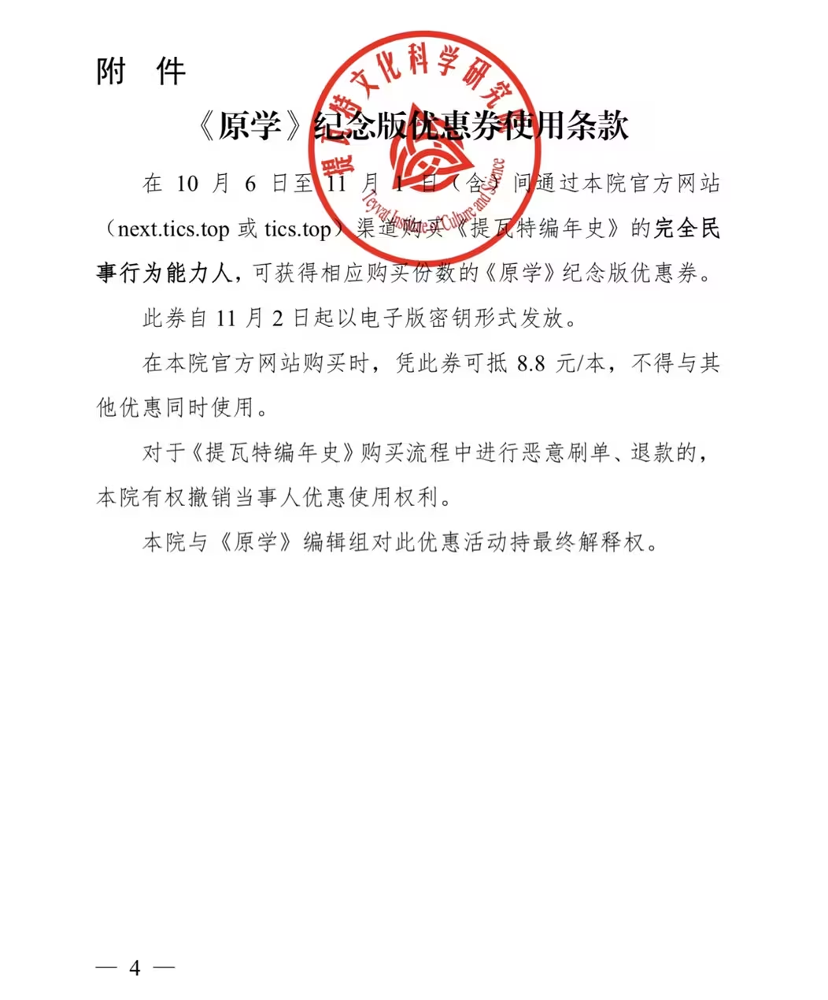
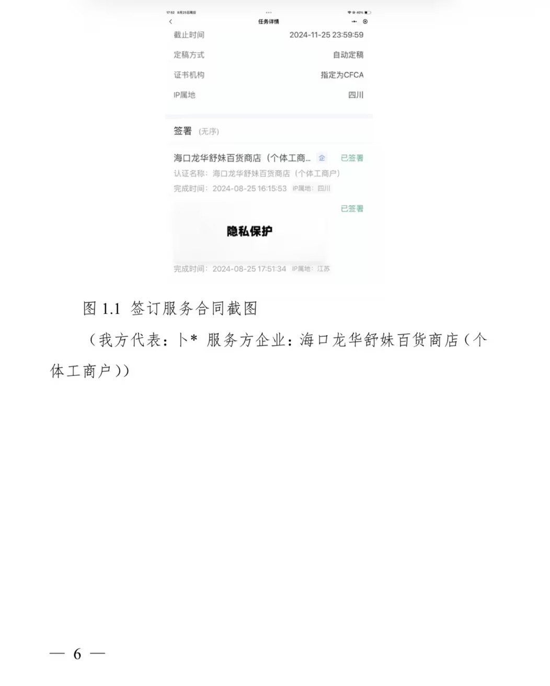
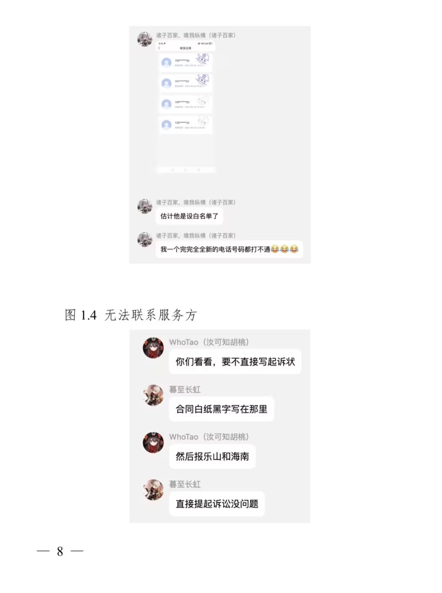
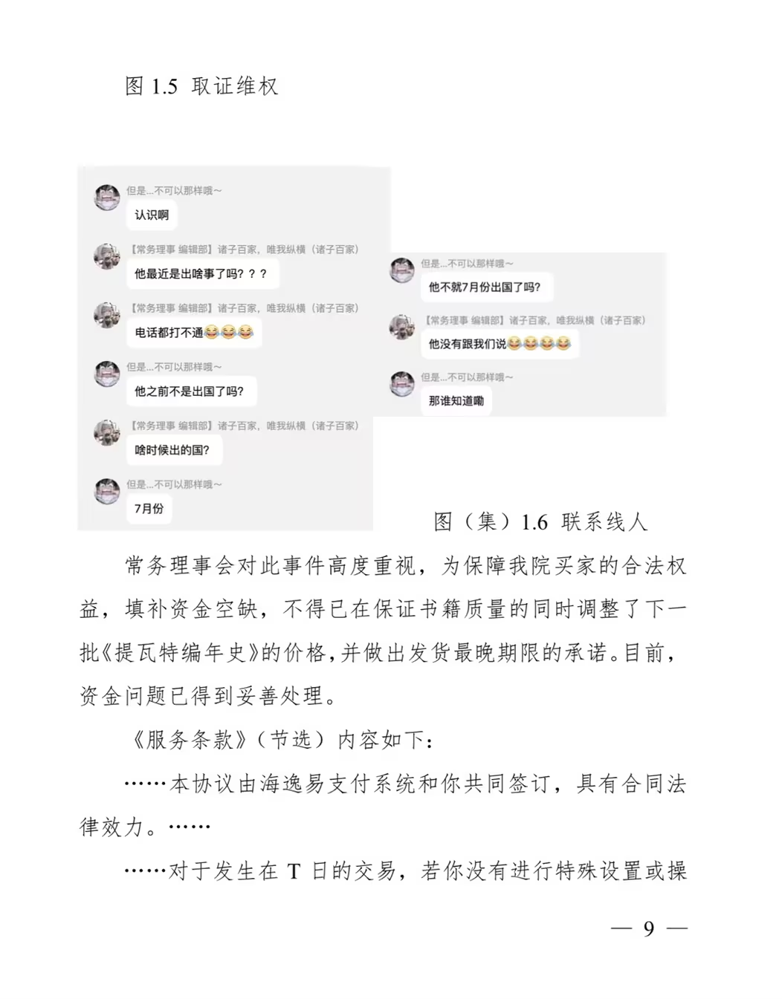
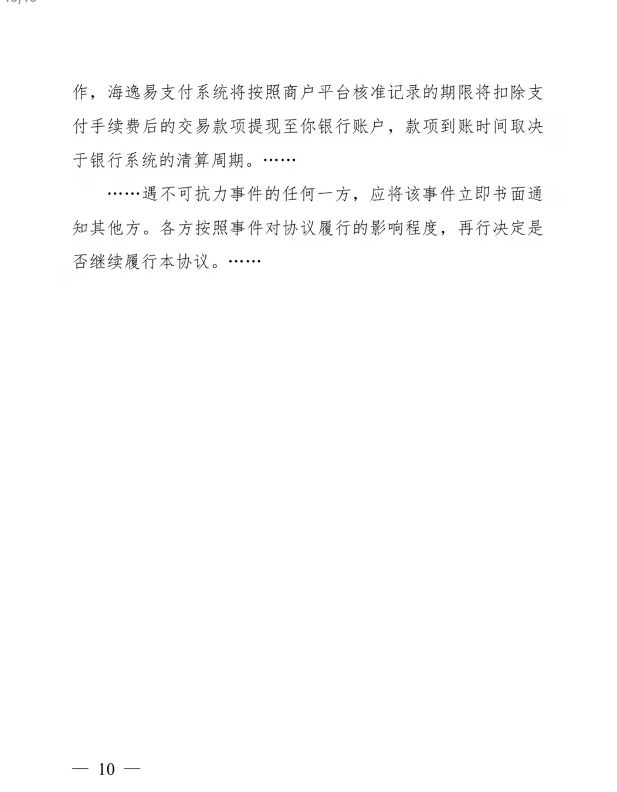

# 动态

## 坚守本心，将好的作品带给粉丝  <Badge type="danger" text=" 2024 年10月27日 07:41 (UTC+8)" />
——提瓦特文化科学研究院  关于《提瓦特编年史》销售事宜的公告
 
全院、全体研究员、全体粉丝：
感谢各位粉丝对本院的大力支持！
经我院内部反复协商决定，自 2024年 11月2日起，将《提瓦特编年史》的价格下调至26.8元/本（↓￥6）。
作为在10月6日至11月1日（含）间购买《提瓦特编年史》以支持本院的粉丝的特别感谢，所有在此期间购书的粉丝可获得《原学》纪念版优惠券一份（￥8.8）。同时，此批次的《提瓦特编年史》将更换为纪念版，添加主创团队及我院领导签名。我们希望通过这一纪念让《提瓦特编年史》成为一份专属记忆，并为粉丝带来一份温暖的体验。关于本批书籍价格调整的原因，除了因应读者反馈改善印刷质量，还有因上批资金短缺而不得已做出的调整，对各位粉丝的损失我们深感抱歉。
自提瓦特文化科学研究院历史研究院《提瓦特编年史》（第一版）问世以来，得到了数以千计忠实粉丝的关注和支持。作为提瓦特历史、文化的守护者与传播者，将每一份真挚的感动与珍贵的历史记录倾注其中，带领每一位旅人穿越时间的长河，回顾这片大陆的过往。提瓦特文化科学研究院始终以弘扬提瓦特精神为己任，不忘来时路、坚守初心、秉承着对提瓦特历史和文化的深切热爱。提瓦特大陆中的每一块石板、每一卷古籍、每一件物品，都是提瓦特历史的生动体现。因此，我们的使命不仅是挖掘这些游戏开发者留下的缕缕线索，更将它们整理成易于粉丝们阅读和了解的形式，以此去使更多的粉丝因此受益。我们深知每一位热爱历史和文化的粉丝都是我们最重要的伙伴，是让提瓦特故事延续的推动者。因此，为所有热爱提瓦特历史的粉丝提供更加实惠的购书价格是本院应尽的责任。
提瓦特文化科学研究院真诚地感谢每一位粉丝的支持与厚爱。我们深知，能够将提瓦特的历史与文化带给每一位热爱这片大陆的人，是我们最大的荣幸与成就。未来的日子里，我们仍将秉持初心，继续追随历史的足迹，探索提瓦特更广阔的文化宝藏。我们始终会将每一位粉丝的支持视作最宝贵的动力源泉，努力为大家带来更多触动心灵的作品和故事。
再次感谢粉丝们的支持，期待在未来的旅途中继续陪伴每一位粉丝！
 
 
提瓦特文化科学研究院
 2024年 10月27日  
 
附件：
（一）《原学》纪念版优惠券使用条款
（二）上一批次《提瓦特编年史》价格调整原因及服务方诈骗
事件公示

## 分享图片  <Badge type="danger" text=" 2024 年10月13日 12:12 (UTC+8)" />

## 国庆节来了！  <Badge type="danger" text=" 2024年 10月01日 21:26 (UTC+8)" />
2024 年的国庆，是祖国繁荣昌盛的又一见证。在这欢乐的节日里，愿山河锦绣，国泰民安。希望每一个人都能感受到国家强大带来的骄傲与自豪，收获满满的欢乐、温馨与幸福。愿和平的白鸽永远翱翔在蓝天之上！ 

提瓦特文化科学研究院 运营宣传部
 2024年 10月1日